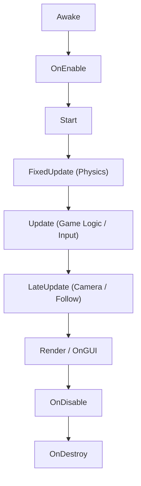

# Bài cũ

## Unity MonoBehaviour Lifecycle

---

### 1. Initialization

Awake (): Chạy duy nhất 1 lần khi load object (khởi tạo biến nội bộ).

OnEnable (): Chạy mỗi khi object/script được kích hoạt (đăng ký Events).

Start (): Chạy 1 lần trước frame đầu tiên khi script bật (liên kết data giữa các Object).

### 2. Game Loop

FixedUpdate (): Chu kỳ cố định (Time.fixedDeltaTime), xử lý vật lý/Rigidbody.

Update (): Chu kỳ mỗi frame (Time.deltaTime), xử lý Input và logic gameplay.

LateUpdate (): Chạy sau Update (), xử lý Camera follow và khớp xương/animation.

### 3. Destruction

OnDisable (): Chạy khi tắt object/script (hủy đăng ký Events).

OnDestroy (): Chạy khi object bị xóa hoàn toàn khỏi Scene.

---

## Unity Gizmos Cheat Sheet

**Gizmos** là các công cụ hình ảnh hỗ trợ debug, trực quan hóa vị trí, phạm vi (tầm nhìn, vùng va chạm, đường đi) trong
**Scene View** (không hiển thị trong bản build Game).

### Callback Functions

* **`OnDrawGizmos()`**: Vẽ liên tục mỗi frame trong Scene view (ngay cả khi không chọn object).
* **`OnDrawGizmosSelected()`**: Chỉ vẽ khi GameObject gắn script được chọn trong Hierarchy/Scene.

---

## Unity Transform & Mathf Cheat Sheet

### 1. Transform (Vị trí, Góc quay, Tỷ lệ)

Mọi GameObject trong Scene đều bắt buộc có một component `Transform`.

#### Thuộc tính cốt lõi

* **Position:**
    * `transform.position`: Tọa độ thế giới (World Space).
    * `transform.localPosition`: Tọa độ tương đối so với Object cha (Local Space).
* **Rotation:**
    * `transform.rotation`: Góc quay dạng Quaternion (World Space).
    * `transform.localEulerAngles`: Góc quay theo độ trục X, Y, Z ($0^\circ - 360^\circ$).
* **Scale:**
    * `transform.localScale`: Kích thước tương đối so với Object cha.
* **Hướng định vị (Normalized Vectors):**
    * `transform.forward` ($+Z$), `transform.right` ($+X$), `transform.up` ($+Y$).

#### Phương thức thường dùng

* **`Translate(translation)`**: Di chuyển Object theo một vector hướng.
* **`Rotate(axis, angle)`**: Xoay Object quanh trục chỉ định.
* **`LookAt(target)`**: Hướng trục Z (forward) của Object trực diện về phía mục tiêu.
* **`SetParent(parentTransform)`**: Gán hoặc gỡ quan hệ cha/con trong Hierarchy.

---

### 2. Mathf (Thư viện hàm toán học)

Cung cấp các phép toán số học và hàm nội suy (interpolation) thông dụng cho game logic.

#### Hàm nội suy & giới hạn (Interpolation & Clamping)

| Hàm               | Cú pháp                                 | Ứng dụng                                                             |
|:------------------|:----------------------------------------|:---------------------------------------------------------------------|
| **`Clamp`**       | `Mathf.Clamp(value, min, max)`          | Giới hạn giá trị trong khoảng (ví dụ: máu từ $0$ đến $100$)          |
| **`Clamp01`**     | `Mathf.Clamp01(value)`                  | Giới hạn nhanh giá trị trong khoảng $[0, 1]$                         |
| **`Lerp`**        | `Mathf.Lerp(a, b, t)`                   | Nội suy tuyến tính từ `a` đến `b` theo tỉ lệ `t` ($0 \le t \le 1$)   |
| **`MoveTowards`** | `Mathf.MoveTowards(curr, target, step)` | Tăng/giảm giá trị đều đặn theo bước `step` (không vượt quá `target`) |
| **`SmoothDamp`**  | `Mathf.SmoothDamp(...)`                 | Làm mượt chuyển động có quán tính (thường dùng cho Camera follow)    |

#### Hàm xử lý số học & góc quay

| Hàm                        | Cú pháp                             | Ứng dụng                                                               |
|:---------------------------|:------------------------------------|:-----------------------------------------------------------------------|
| **`Abs`**                  | `Mathf.Abs(f)`                      | Lấy giá trị tuyệt đối $                                                |f|$ |
| **`Round / Floor / Ceil`** | `Mathf.Floor(f)`...                 | Làm tròn số: gần nhất, làm tròn xuống, làm tròn lên                    |
| **`PingPong`**             | `Mathf.PingPong(t, length)`         | Tạo giá trị dao động qua lại giữa $0$ và `length` (hiệu ứng tuần hoàn) |
| **`DeltaAngle`**           | `Mathf.DeltaAngle(current, target)` | Tính góc quay ngắn nhất giữa 2 góc theo độ ($^\circ$)                  |
| **`Approximately`**        | `Mathf.Approximately(a, b)`         | So sánh bằng giữa 2 số thực (`float`) an toàn                          |

---